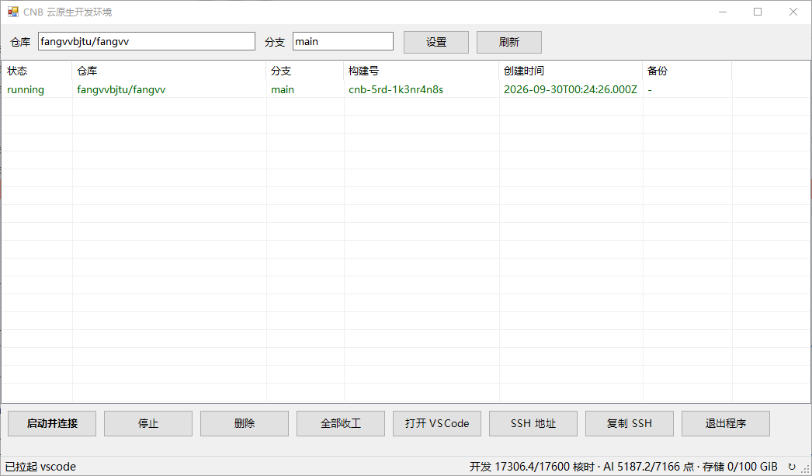
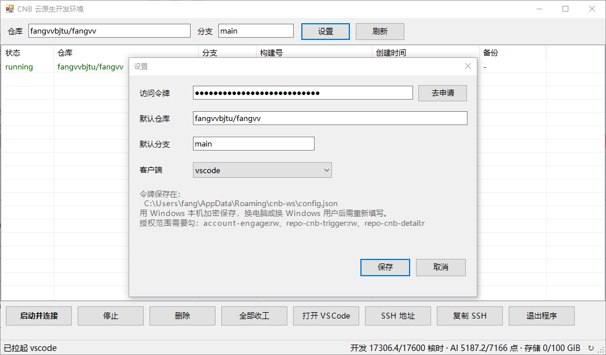

# CNB 云原生开发环境 · Windows 图形管理面板

一个零安装、零依赖的 Windows 桌面小工具，用来管理 [CNB](https://cnb.cool) 的云原生开发环境：看一眼当前有哪些环境在跑、一键启动 / 停止 / 删除、复制 SSH 地址、自动拉起本地 IDE 远程连接，顺便把额度也盯在状态栏里。

只用到 Windows 自带的 PowerShell 5.1 + .NET（WinForms），不需要装 Node、Python、浏览器或任何命令行工具。

---

## 功能

- **环境列表**：一次看清所有开发环境的状态 / 仓库 / 分支 / 构建号 / 创建时间 / 备份文件数，运行中的绿色、已关闭的灰色。
- **一键启动并连接**：没有环境就新建，已有就直接连；就绪后自动拉起本地 IDE。
- **停止 / 删除 / 全部收工**：支持选中操作，未选中时默认作用于全部运行中 / 已关闭的环境。
- **多客户端**：支持 VSCode、VSCode Insiders、Cursor、CodeBuddy（国内 / 国际版）、Windsurf、Zed，在设置里切换，连接地址会按所选客户端自动取。
- **SSH 连接信息**：弹窗显示 SSH 登录命令、远程地址、各客户端地址，可直接选中复制，并附接口原始返回便于排查字段变化。
- **复制 SSH**：不弹窗，直接把 SSH 登录命令塞进剪贴板。
- **额度监控**：状态栏显示开发核时、AI 点数、存储用量，点击即时刷新、每 10 分钟自动刷新；见底时数字变红、托盘图标变橙、气泡提醒。
- **托盘常驻**：点右上角 X 是缩到托盘，不退出；托盘菜单可快速打开面板 / 启动并连接 / 全部收工 / 刷新额度 / 退出。
- **单实例**：只允许一个实例在跑，重复双击启动会自动把已有面板叫到前台。
- **双击快捷操作**：双击运行中的行直接连接；双击已关闭的行按它自己的仓库 / 分支重开。

---

## 界面预览

---

## 设计思路

- **零安装、零依赖**：只依赖 Windows 自带的 PowerShell 5.1 与 .NET WinForms，拷走两个文件就能用，不引入任何运行时。
- **直连 OpenAPI**：直接调用 `https://api.cnb.cool` 的 OpenAPI，不依赖第三方 CLI，行为完全可控。
- **令牌本地加密**：访问令牌用 Windows DPAPI 加密后保存在本机 `%APPDATA%\cnb-ws\config.json`，换电脑或换 Windows 用户需重新填写，绝不明文落盘。
- **无黑窗口启动**：启动器经 `mshta` 中转，以隐藏方式拉起 PowerShell 后立刻退出，双击不留黑色命令行窗口；关面板也不会把 VSCode / 浏览器一起带走（打开链接统一走常驻的 `explorer.exe` 中转）。
- **托盘 + 单例**：它是常驻型工具而非一次性脚本，关窗口即缩托盘；单例用内核级命名 Mutex 判重，崩了也不会留下假占用。
- **编码细节**：`cnb-gui.ps1` 存为 UTF-8 带 BOM、`CNB-Workspace.bat` 存为 GBK，三处对上才能保证中文不乱码（详见下文「常见问题」）。

---

## 使用方法

### 环境要求

- Windows 10 / 11（自带 Windows PowerShell 5.1+）。

### 快速开始

1. 双击 `CNB-Workspace.bat`。
2. 首次运行会弹出「设置」窗口，填入：
   - **访问令牌**：在 <https://cnb.cool/profile/token> 生成，授权范围勾选 `account-engage:rw`、`repo-cnb-trigger:rw`、`repo-cnb-detail:r`。
   - **默认仓库**：格式 `组织/仓库`，例如 `your-org/your-repo`。
   - **默认分支**、**客户端**（默认 VSCode）。
3. 点「保存」，面板会自动读取环境列表并显示额度。
4. 之后每次双击启动，都会自动读回上次保存的配置，无需重复填写。

### 界面说明

- 顶部：**仓库**、**分支**输入框（临时改），**设置**、**刷新**按钮。
- 中部：环境列表，双击运行中的行直接连接；双击已关闭的行按它自己的仓库 / 分支重开。
- 底部按钮：**启动并连接**、**停止**、**删除**、**全部收工**、**打开 VSCode**（实际打开的是设置里选中的客户端）、**SSH 地址**、**复制 SSH**、**退出程序**。
- 左下角状态栏：`共 N 个环境 · 运行中 x · 已关闭 y`；右下角为额度，点击可手动刷新。

### 托盘与快捷操作

- 点右上角 X = 缩到托盘；双击托盘图标 = 重新打开面板。
- 托盘菜单：打开面板 / 启动并连接 / 全部收工 / 刷新额度 / 退出。
- 重复双击启动脚本，会把已经运行的面板叫到前台，不会开第二个。

### 常见问题

- **中文乱码**：`CNB-Workspace.bat` 必须保持 GBK 编码、`cnb-gui.ps1` 必须保持 UTF-8 带 BOM。GitHub 网页上 `.bat` 的中文注释显示成乱码是正常的，不要“修复”成 UTF-8。
- **顶部输入框改了不生效 / 重启就丢**：顶部输入框只是临时改动，想长期记住请在「设置」里改并点「保存」。
- **想开第二个实例（调试用）**：先 `set CNB_GUI_MULTI=1` 再启动即可绕过单例限制。
- **想看到启动命令输出（排障）**：命令行里运行 `CNB-Workspace.bat --console`，以可见方式启动。

---

## CNB 平台介绍

[CNB（云原生构建）](https://cnb.cool) 是腾讯云的云原生构建平台，提供代码托管、云原生构建（流水线）、**云原生开发**（远程开发环境 / WebIDE）、制品库、AI 助手等一体化研发能力。

其中「云原生开发」是本工具管理的对象：无需在本地配置环境，点一下即可在云端拉起带完整工具链的开发环境，通过 WebIDE、VS Code、Cursor、JetBrains Gateway 等客户端远程连接，代码与文件会自动备份、漫游。官方文档见 <https://docs.cnb.cool>，OpenAPI 见 <https://api.cnb.cool>。

---

## 更多免费额度

[CNB](https://cnb.cool) 本身已提供免费额度，在 [启悟](https://qiwoo.edu.cn/ui/innovation-space) 完成**高校身份认证**后，还可以获得更多免费额度。认证方法及具体额度规则，以该平台页面说明为准。

---

## 致谢

感谢 [CNB](https://cnb.cool) 提供免费、稳定的云原生开发环境和开放、易用的 OpenAPI，让这个「零安装的小面板」得以实现。也感谢平台对开发者体验的持续投入。

---

## 文件说明

- `CNB-Workspace.bat`：启动器（双击即可，GBK 编码，带 `--console` 调试入口）。
- `cnb-gui.ps1`：图形面板本体（UTF-8 带 BOM 编码）。
- `README.md`：本说明文档。
